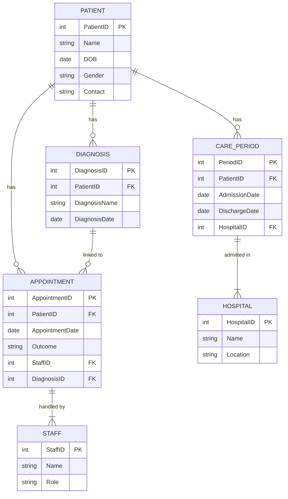

# Entity-Relationship Diagram

```mermaid
erDiagram
    PATIENT ||--o{ APPOINTMENT : has
    PATIENT ||--o{ CARE_PERIOD : has
    PATIENT ||--o{ DIAGNOSIS : has
    APPOINTMENT ||--|{ STAFF : "handled by"
    CARE_PERIOD ||--|{ HOSPITAL : "admitted in"
    DIAGNOSIS ||--o{ APPOINTMENT : "linked to"
    
    PATIENT {
        int PatientID PK
        string Name
        date DOB
        string Gender
        string Contact
    }
    
    APPOINTMENT {
        int AppointmentID PK
        int PatientID FK
        date AppointmentDate
        string Outcome
        int StaffID FK
        int DiagnosisID FK
    }
    
    CARE_PERIOD {
        int PeriodID PK
        int PatientID FK
        date AdmissionDate
        date DischargeDate
        int HospitalID FK
    }
    
    DIAGNOSIS {
        int DiagnosisID PK
        int PatientID FK
        string DiagnosisName
        date DiagnosisDate
    }
    
    STAFF {
        int StaffID PK
        string Name
        string Role
    }
    
    HOSPITAL {
        int HospitalID PK
        string Name
        string Location
    }
```