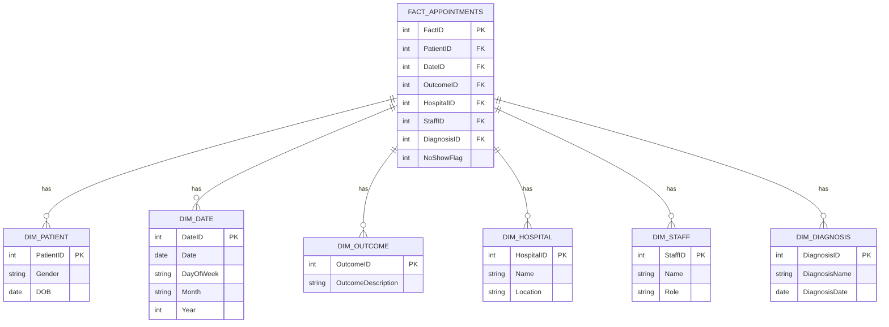

# 

```mermaid
erDiagram
    FACT_APPOINTMENTS ||--o{ DIM_PATIENT : has
    FACT_APPOINTMENTS ||--o{ DIM_DATE : has
    FACT_APPOINTMENTS ||--o{ DIM_OUTCOME : has
    FACT_APPOINTMENTS ||--o{ DIM_HOSPITAL : has
    FACT_APPOINTMENTS ||--o{ DIM_STAFF : has
    FACT_APPOINTMENTS ||--o{ DIM_DIAGNOSIS : has
    
    FACT_APPOINTMENTS {
        int FactID PK
        int PatientID FK
        int DateID FK
        int OutcomeID FK
        int HospitalID FK
        int StaffID FK
        int DiagnosisID FK
        int NoShowFlag
    }
    
    DIM_PATIENT {
        int PatientID PK
        string Gender
        date DOB
    }
    
    DIM_DATE {
        int DateID PK
        date Date
        string DayOfWeek
        string Month
        int Year
    }
    
    DIM_OUTCOME {
        int OutcomeID PK
        string OutcomeDescription
    }
    
    DIM_HOSPITAL {
        int HospitalID PK
        string Name
        string Location
    }
    
    DIM_STAFF {
        int StaffID PK
        string Name
        string Role
    }
    
    DIM_DIAGNOSIS {
        int DiagnosisID PK
        string DiagnosisName
        date DiagnosisDate
    }
```